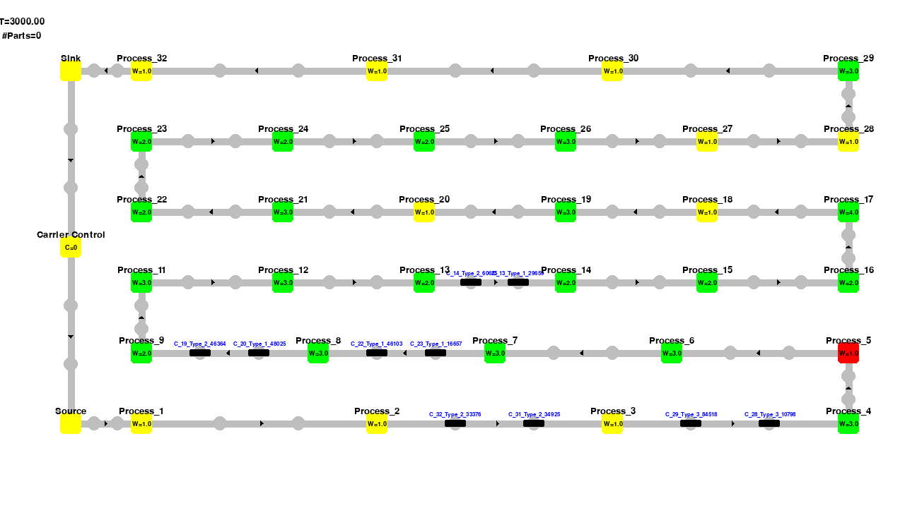

# SeqAssignLine

Code Repository for experimenting with the `LineFlow` framework to simulate a large-scal sequential
assembly line. The actions space includes 10^48 possible actions, pushing the limits of current RL-models.



# Install

Install with

```bash
pip install .
```

# Usage


```python
from lineflow_ef import Seq_Pro_Assembly

line = Seq_Pro_Assembly()
line.run(3000, visualize=True)
```

